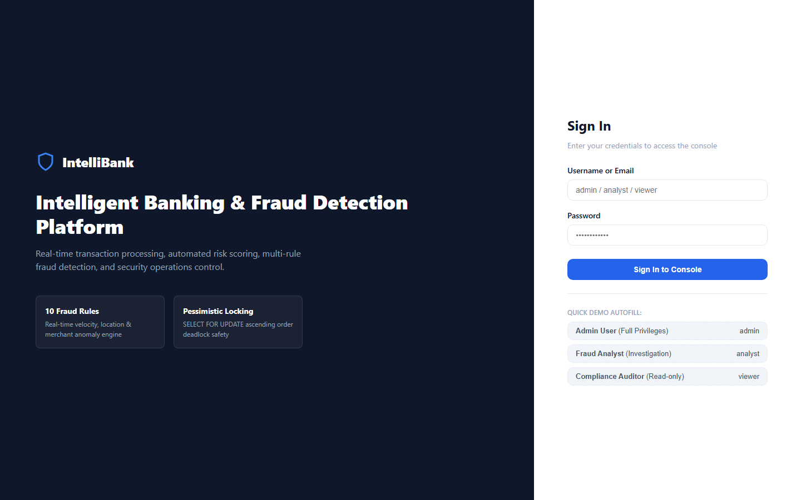
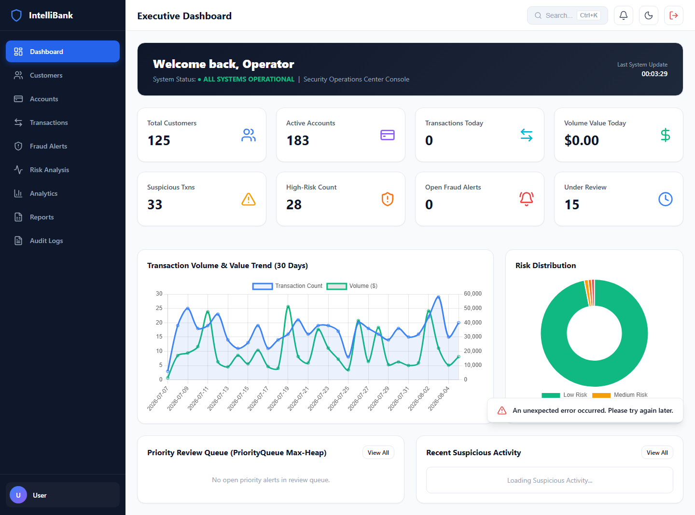
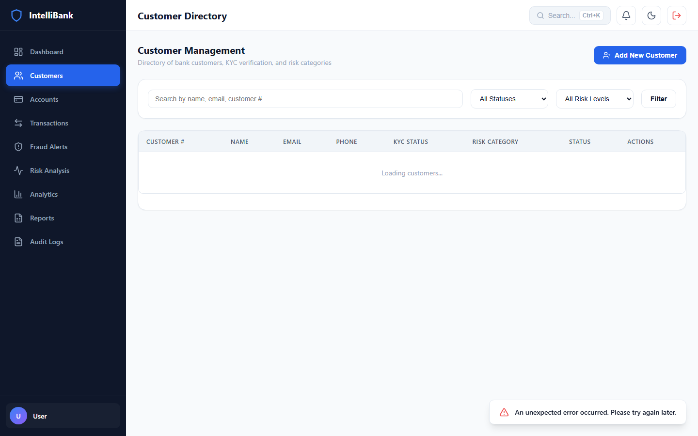
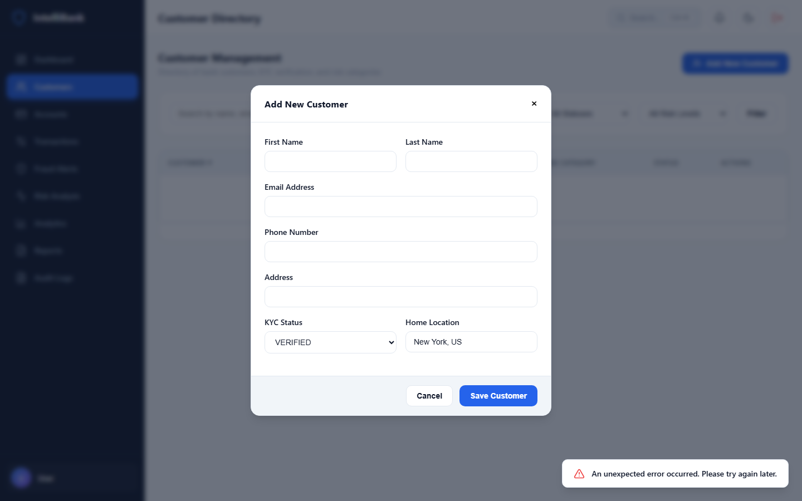
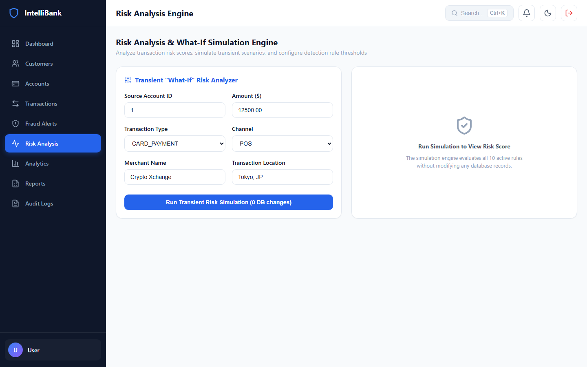
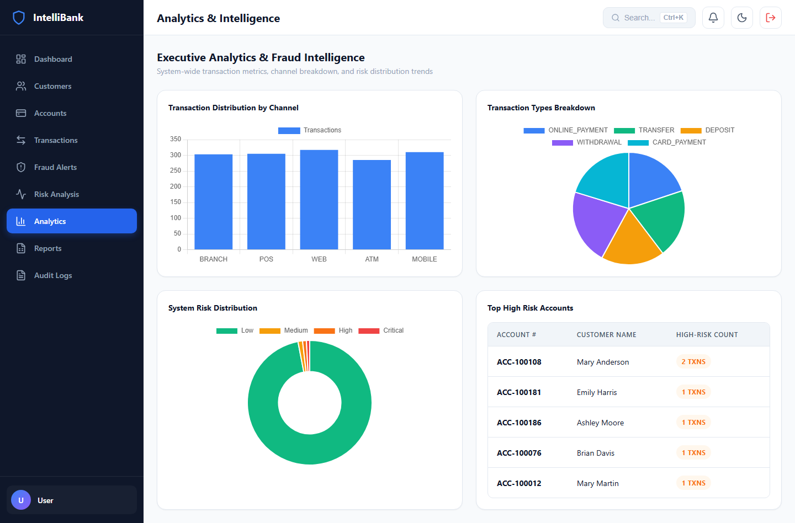
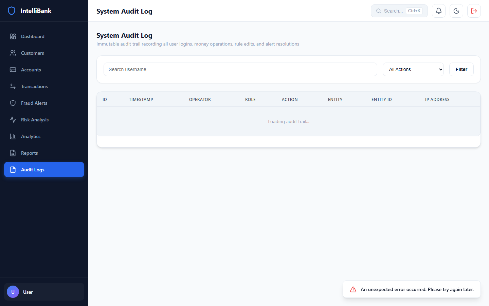

# IntelliBank – Intelligent Banking Transaction & Fraud Detection System

> A portfolio-grade banking transaction processing and fraud detection platform built with **Java 21**, **Embedded Jetty 11**, **Plain JDBC + HikariCP**, **MySQL**, and a **Vanilla JavaScript SPA** with Chart.js and Lucide Icons.

IntelliBank simulates a modern banking security platform where financial transactions are validated, analyzed, risk-scored, and either completed, monitored, held for review, or blocked according to configurable fraud detection rules.

---

## 📌 Overview

Modern banking systems process large volumes of transactions across ATM, POS, mobile, web, and branch channels. Fraud can appear through unusual transaction amounts, rapid transaction bursts, geographic anomalies, channel switching, high-risk merchants, repeated failed attempts, duplicate submissions, and account-limit breaches.

**IntelliBank** addresses these scenarios through a Java-based transaction processing pipeline combined with a configurable fraud detection and risk scoring engine.

The project demonstrates practical experience with:

- Core Java
- Object-Oriented Programming
- Data Structures and Algorithms
- JDBC
- MySQL
- SQL
- REST APIs
- Financial transaction processing
- Fraud detection
- Risk scoring
- Authentication
- Role-Based Access Control
- Database transactions
- Concurrency control
- Audit logging
- Data visualization
- Responsive frontend development

---

# 📸 Application Screenshots

## Login



## dashboard



## Customers



## Customer Details





## Analytics



## Audit Trail



## Reports


---

# ✨ Key Features

## Banking Transaction Processing

- Deposit processing
- Withdrawal processing
- Account-to-account transfers
- Transaction validation
- Balance verification
- Daily transaction limits
- Account state validation
- Transaction status management
- Idempotency protection
- Atomic database operations

## Fraud Detection

The application evaluates transactions against 10 configurable fraud rules:

1. High-value transactions
2. Transaction velocity spikes
3. Unusual transaction amounts
4. Geographic location anomalies
5. Channel switching anomalies
6. Repeated failed transactions
7. Rapid large transactions
8. High-risk merchants
9. Daily account limit breaches
10. Duplicate transaction submissions

## Risk Scoring

Every transaction receives a risk score from **0 to 100**.

|  Score | Risk Level | Decision       |
| -----: | ---------- | -------------- |
|   0–29 | `LOW`      | Allow          |
|  30–59 | `MEDIUM`   | Monitor        |
|  60–79 | `HIGH`     | Manual Review  |
| 80–100 | `CRITICAL` | Block & Review |

The system also displays the individual rules and evidence that contributed to the final risk score.

## Fraud Investigation

Authorized analysts can:

- Open fraud alerts
- Review transaction evidence
- View customer activity
- Inspect risk scores
- Review triggered rules
- Add investigation notes
- Mark false positives
- Confirm fraud
- Resolve alerts

## What-If Risk Simulator

The application includes a transient risk simulator that evaluates hypothetical transaction scenarios against the active fraud rules without modifying persistent database data.

## Analytics

The analytics module provides:

- Transaction volume
- Transaction value
- Fraud alerts
- Risk distribution
- Channel breakdown
- Transaction type distribution
- High-risk accounts
- High-risk customers
- Average transaction value
- Fraud trends

---

# 🛠️ Technology Stack

## Backend

- Java 21 LTS
- Embedded Jetty 11
- Jakarta Servlet
- Plain JDBC
- HikariCP
- Gson
- JJWT
- jBCrypt
- SLF4J
- Logback
- Maven

## Frontend

- HTML5
- CSS3
- Vanilla JavaScript ES Modules
- Hash-based SPA routing
- Chart.js
- Lucide Icons
- Custom SVG visualizations
- Responsive CSS
- Dark mode

## Database

- MySQL 8+
- MySQL 9.x compatible
- JDBC transactions
- Foreign keys
- Indexes
- `DECIMAL(15,2)` monetary values
- JSON-based rule/evidence storage where applicable

## Testing

- JUnit 5
- Mockito
- API integration testing
- Playwright E2E automation

---

# 🏗️ System Architecture

```text
┌───────────────────────────────────────────────────────────────┐
│                         FRONTEND SPA                         │
│                                                               │
│  HTML5 + CSS3 + Vanilla JavaScript ES Modules                │
│  Chart.js + Lucide Icons + SVG Visualizations                │
└───────────────────────────────┬───────────────────────────────┘
                                │
                                │ REST / JSON
                                ▼
┌───────────────────────────────────────────────────────────────┐
│                    EMBEDDED JETTY 11                         │
│                                                               │
│ SecurityHeaderFilter → AuthFilter (JWT + RBAC)                │
│                                                               │
│ Auth / Customer / Account / Transaction / Fraud / Risk        │
│ Analytics / Reports / Audit / Users / Notifications / Health  │
└───────────────────────────────┬───────────────────────────────┘
                                │
                                ▼
┌───────────────────────────────────────────────────────────────┐
│                       SERVICE LAYER                           │
│                                                               │
│ AuthService                                                  │
│ CustomerService                                              │
│ AccountService                                                │
│ TransactionService                                           │
│ FraudDetectionService                                       │
│ RiskScoringService                                          │
│ NotificationService                                         │
│ AuditLogService                                              │
│                                                               │
│ DSA Utilities                                                 │
│ Sliding Window / Priority Queue / HashMap / HashSet           │
└───────────────────────────────┬───────────────────────────────┘
                                │
                                ▼
┌───────────────────────────────────────────────────────────────┐
│                         DAO LAYER                             │
│                                                               │
│ UserDao / CustomerDao / AccountDao / TransactionDao          │
│ FraudRuleDao / FraudAlertDao / RiskScoreDao                  │
│ NotificationDao / AuditLogDao                                │
│                                                               │
│ HikariCP + PreparedStatement + JDBC                           │
└───────────────────────────────┬───────────────────────────────┘
                                │
                                ▼
┌───────────────────────────────────────────────────────────────┐
│                         MYSQL                                 │
│                                                               │
│ intellibank_db                                               │
│ Customers / Accounts / Transactions / Fraud / Risk / Audit    │
└───────────────────────────────────────────────────────────────┘
```
