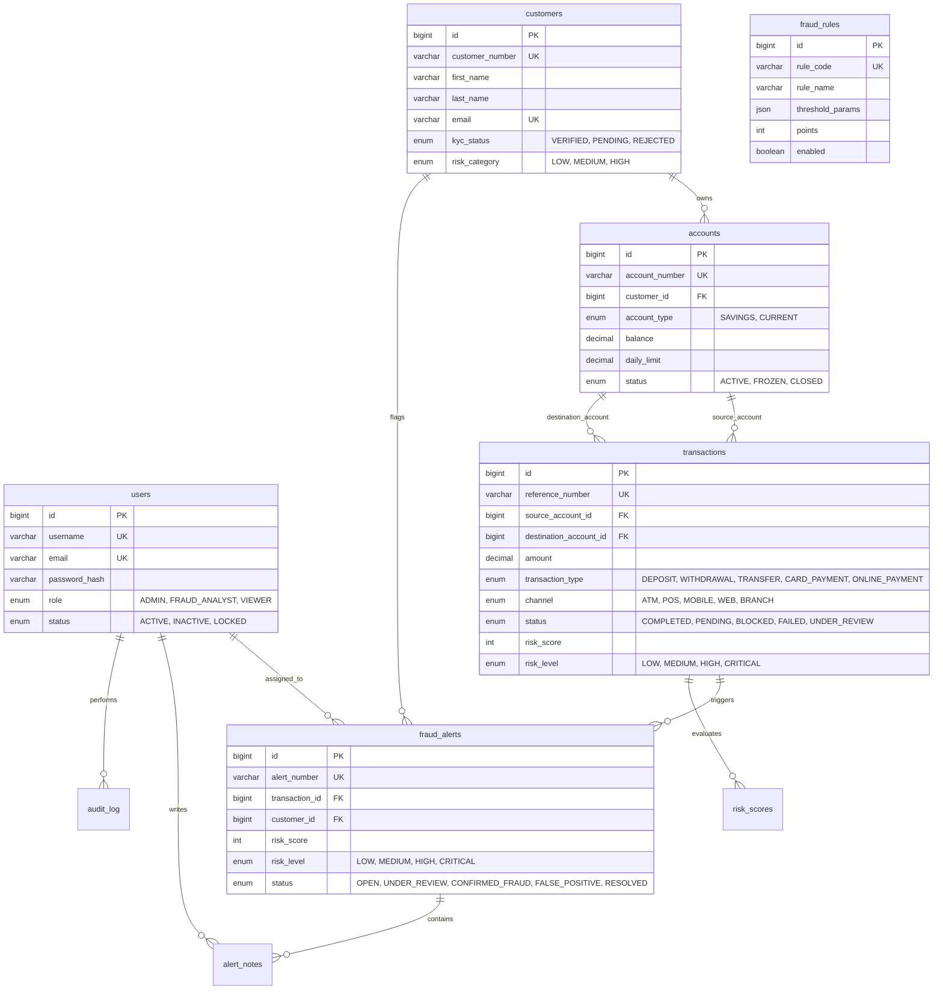

# IntelliBank - Intelligent Banking Transaction & Fraud Detection System

> A portfolio-grade, production-ready B2B banking transaction and fraud detection web application built with **Java 21**, **Embedded Jetty 11**, **Plain JDBC (HikariCP)**, **MySQL 9/8**, and a **Vanilla JavaScript SPA Frontend** with **Chart.js** and **Lucide icons**.

---

## 1. Overview & Problem Statement

Modern core banking applications process millions of high-velocity transactions daily across diverse payment channels (ATM, POS, Mobile, Web, Branch). Financial institutions face sophisticated fraud vectors, including velocity bursts, geographic location anomalies, high-risk merchant spikes, account limit breaches, and duplicate submission exploits.

**IntelliBank** solves this challenge by integrating a real-time banking transaction pipeline with an automated multi-rule **Fraud Detection & Risk Scoring Engine**. Every incoming transaction is dynamically evaluated against 10 configurable fraud rules BEFORE funds are committed, enforcing strict risk-based decisions (`LOW`, `MEDIUM`, `HIGH`, `CRITICAL`), pessimistic database row locking, and atomic rollback guarantees.

---

## 2. Key Features

- **Real-Time Transaction Pipeline**: Processes deposits, withdrawals, and account-to-account transfers with pessimistic database locking (`SELECT ... FOR UPDATE` in ascending Account ID order) to prevent deadlocks and race conditions.
- **10-Rule Fraud Detection Engine**: Automated evaluation of high value, velocity bursts, unusual amounts, geographic travel anomalies, channel switching, repeated failed attempts, rapid large transfers, high-risk merchants, daily limit breaches, and duplicate submissions.
- **Risk Scoring & Decisioning**: Dynamic risk score calculation (0–100) mapped to four operational risk levels (`LOW`, `MEDIUM`, `HIGH`, `CRITICAL`) with plain language evidence explanations.
- **Analyst Investigation Center**: Interactive alert management drawer with SVG risk gauges, rule evidence cards, false positive funds release workflow, and confirmed fraud account freeze triggers.
- **Transient "What-If" Simulator**: Evaluate hypothetical transaction parameters in real-time against active fraud rules with ZERO database mutations.
- **Custom DSA Components**: High-performance data structure implementations (`SlidingWindowTimestampDeque`, `DuplicateHashSet`, `RiskPriorityQueue`, `BinarySearchUtils`, `EntityHashMapCache`).
- **Enterprise Security & Server-Side RBAC**: BCrypt password hashing (cost 10), signed JWT authentication, login rate-limiting/lockout, server-side RBAC (`ADMIN`, `FRAUD_ANALYST`, `VIEWER`), and unified JSON error handling.
- **100% Offline Capable**: Zero CDN dependencies; self-hosted Chart.js, Lucide icons, and CSS design system.

---

## 3. Technology Stack

- **Backend**: Java 21 LTS, Embedded Jetty 11.0.24 (Jakarta Servlet 5.0), Plain JDBC, HikariCP 5.1.0, MySQL Connector/J 9.0.0, Gson 2.10.1, JJWT 0.12.6, BCrypt (jBCrypt 0.4), SLF4J + Logback.
- **Frontend**: HTML5, CSS3 (Vanilla CSS with Custom Property Tokens & Dark Mode), Vanilla JavaScript (ES Modules SPA with hash routing `#/`), Chart.js (v4.4.1), Lucide Icons.
- **Testing**: JUnit 5 (Jupiter), Mockito, Playwright E2E automation.
- **Build & Packaging**: Maven wrapper (`mvnw`/`mvnw.cmd`), Maven Shade Plugin for executable fat JAR (`target/intellibank.jar`).

---

## 4. System Architecture

```
+---------------------------------------------------------------------------------+
|                                 FRONTEND (SPA)                                  |
|   HTML5 / CSS3 (CSS Variables, Dark Mode) / Vanilla JS (ES Modules)             |
|   Chart.js / Lucide Icons / Custom SVG Visualizations / Hash Routing (#/...)    |
+---------------------------------------------------------------------------------+
                                        |  REST API (JSON over HTTP)
                                        v
+---------------------------------------------------------------------------------+
|                           JETTY 11 EMBEDDED SERVER                              |
|  +---------------------------------------------------------------------------+  |
|  | Filters: SecurityHeaderFilter -> AuthFilter (JWT & RBAC)                  |  |
|  +---------------------------------------------------------------------------+  |
|  | Servlets: Auth, Customer, Account, Transaction, Fraud, Risk, Analytics,    |  |
|  |           Report, Audit, User, Notification, Health, Static Asset Handler |  |
|  +---------------------------------------------------------------------------+  |
+---------------------------------------------------------------------------------+
                                        |
                                        v
+---------------------------------------------------------------------------------+
|                                 SERVICE LAYER                                   |
|   AuthService / TransactionService / FraudDetectionService / RiskScoringService |
|   CustomerService / AccountService / NotificationService / AuditLogService      |
|   DSA Helpers: SlidingWindow, PriorityQueue, HashMap Cache, Binary Search       |
+---------------------------------------------------------------------------------+
                                        |
                                        v
+---------------------------------------------------------------------------------+
|                                   DAO LAYER                                     |
|   UserDao / CustomerDao / AccountDao / TransactionDao / FraudRuleDao /          |
|   FraudAlertDao / RiskScoreDao / NotificationDao / AuditLogDao (HikariCP JDBC)  |
+---------------------------------------------------------------------------------+
                                        |
                                        v
+---------------------------------------------------------------------------------+
|                              MYSQL DATABASE                                     |
|   intellibank_db (10 tables, indexes, composite velocity indexes, DECIMAL money)|
+---------------------------------------------------------------------------------+
```

---

## 5. Database Schema (Mermaid ER Diagram)



---

## 6. Fraud Detection Rules & Risk Scoring

### 10 Detection Rules
| Rule Code | Rule Name | Points | Description & Threshold |
|---|---|---|---|
| `HIGH_VALUE` | High Value Transaction | +20 | Amount exceeds configured high-value threshold (`$10,000.00`) |
| `VELOCITY` | Transaction Velocity Spike | +15 | Exceeds max count of transactions in 5-minute sliding window (`5 txns`) |
| `UNUSUAL_AMOUNT` | Unusual Amount vs Avg | +20 | Amount exceeds 3.0x customer's 30-day historical average |
| `LOCATION_ANOMALY` | Geographic Location Anomaly | +15 | Impossible travel velocity between consecutive transaction locations |
| `CHANNEL_ANOMALY` | Channel Switching Anomaly | +10 | Rapid switching across 3 or more distinct transaction channels |
| `REPEATED_FAILED` | Repeated Failed Transactions | +10 | 3 or more failed/declined attempts within 10-minute window |
| `RAPID_LARGE_TXN` | Rapid Large Transactions | +15 | 2 or more consecutive transactions $\ge \$5,000.00$ in 10 minutes |
| `HIGH_RISK_MERCHANT` | High Risk Merchant Category | +10 | Merchant in high-risk categories (Crypto, Gambling, Offshore, Wire) |
| `DAILY_LIMIT_BREACH` | Daily Account Limit Breach | +15 | Cumulative daily total exceeds account's daily limit |
| `DUPLICATE_TXN` | Duplicate Submission | +20 | Identical account, amount, and merchant submitted within 2 minutes |

*Total score is capped at 100 max.*

### Risk Decision Matrix
| Score Range | Risk Level | Pipeline Decision | Action Taken |
|---|---|---|---|
| **0 – 29** | `LOW` | **ALLOW** | Transaction `COMPLETED`; funds moved immediately. |
| **30 – 59** | `MEDIUM` | **MONITOR** | Transaction `COMPLETED`; `MONITOR` flag & analyst notification created. |
| **60 – 79** | `HIGH` | **MANUAL REVIEW** | Status `UNDER_REVIEW`; **funds held**; OPEN Fraud Alert created. |
| **80 – 100** | `CRITICAL` | **BLOCK & REVIEW** | Status `BLOCKED`; **funds blocked**; OPEN Fraud Alert + Urgent notification. |

---

## 7. Data Structures & Algorithms (DSA) Implementation Reference

| Data Structure | Class Name | Location in Codebase | Purpose & Usage |
|---|---|---|---|
| **HashMap (Concurrent)** | `EntityHashMapCache` | `com.intellibank.util.dsa.EntityHashMapCache` | Fast $O(1)$ in-memory caching of Customer and Account entity profiles during transaction pipeline execution. |
| **HashSet** | `DuplicateHashSet` | `com.intellibank.util.dsa.DuplicateHashSet` | $O(1)$ duplicate transaction submission detection using composite keys (`accountId:amount:merchant:bucket`). |
| **Sliding Window (Deque)** | `SlidingWindowTimestampDeque` | `com.intellibank.util.dsa.SlidingWindowTimestampDeque` | ArrayDeque-backed sliding time-window for transaction velocity and rapid consecutive large transaction tracking. |
| **PriorityQueue (Max-Heap)** | `RiskPriorityQueue` | `com.intellibank.util.dsa.RiskPriorityQueue` | Max-heap ordered by risk score descending, backing the Priority Review Queue in the analyst dashboard. |
| **Binary Search** | `BinarySearchUtils` | `com.intellibank.util.dsa.BinarySearchUtils` | Uses `Collections.binarySearch` to locate time-range start indices in chronologically sorted transaction lists. |

---

## 8. REST API Reference

| Method | Endpoint | Access Role | Description |
|---|---|---|---|
| `POST` | `/api/auth/login` | Public | Authenticates credentials, rate-limits attempts, returns JWT token |
| `POST` | `/api/auth/logout` | Authenticated | Invalidates session |
| `GET` | `/api/auth/me` | Authenticated | Returns current authenticated user profile |
| `GET` | `/api/customers` | ALL | Search & list paginated customers |
| `POST` | `/api/customers` | ADMIN, ANALYST | Create new customer profile |
| `POST` | `/api/customers/{id}/deactivate` | ADMIN, ANALYST | Deactivates customer (safety checks balance & alerts) |
| `GET` | `/api/accounts` | ALL | Search & list accounts |
| `POST` | `/api/accounts/deposit` | ADMIN, ANALYST | Executes deposit pipeline |
| `POST` | `/api/accounts/withdraw` | ADMIN, ANALYST | Executes withdrawal pipeline |
| `POST` | `/api/accounts/transfer` | ADMIN, ANALYST | Executes transfer pipeline with pessimistic locking |
| `POST` | `/api/accounts/{id}/freeze` | ADMIN, ANALYST | Freezes account |
| `GET` | `/api/transactions` | ALL | Search & list transactions with risk filters |
| `POST` | `/api/transactions` | ADMIN, ANALYST | Submits new transaction into full pipeline |
| `GET` | `/api/fraud/alerts` | ALL | List fraud alerts with status counts |
| `POST` | `/api/fraud/alerts/{id}/status` | ADMIN, ANALYST | Resolves alert (False Positive releases funds; Confirm Fraud blocks) |
| `POST` | `/api/fraud/alerts/{id}/notes` | ADMIN, ANALYST | Appends analyst note to investigation log |
| `GET` | `/api/risk/analyze/{id}` | ALL | Retrieves risk score breakdown for transaction |
| `POST` | `/api/risk/simulate` | ALL | Transient "What-If" risk analyzer (0 DB modifications) |
| `PUT` | `/api/fraud/rules/{code}` | ADMIN | Updates rule points, enabled status, and threshold parameters |
| `GET` | `/api/analytics` | ALL | Returns KPIs, volume/value trends, channel & risk distribution |
| `GET` | `/api/reports/*/export-csv` | ALL | Streams CSV export file with proper escaping |
| `GET` | `/api/audit-log` | ALL | Search system audit log trail |
| `GET` | `/api/users` | ADMIN | List system operators |
| `POST` | `/api/users` | ADMIN | Create user account |
| `GET` | `/api/health` | Public | Database connectivity & system health check |

---

## 9. Project Structure

```
intellibank/
├── database/
│   ├── schema.sql
│   └── seed.sql
├── docs/
│   ├── INTERACTION_MATRIX.md
│   └── SETUP.md
├── e2e/
│   ├── generate-screenshots.js
│   └── package.json
├── screenshots/
│   ├── 01-login.png ... 14-mobile-view.png
├── src/
│   ├── main/
│   │   ├── java/com/intellibank/
│   │   │   ├── config/ (AppConfig, DatabaseConfig)
│   │   │   ├── controller/ (Servlets: Auth, Customer, Account, Transaction, Fraud, Risk, etc.)
│   │   │   ├── dao/ (UserDao, CustomerDao, AccountDao, TransactionDao, FraudAlertDao, etc.)
│   │   │   ├── dto/ (ApiResponse)
│   │   │   ├── exception/ (BusinessException)
│   │   │   ├── filter/ (SecurityHeaderFilter, AuthFilter, GlobalExceptionHandlerFilter)
│   │   │   ├── fraud/ (FraudDetectionService, FraudRule interface, rules/ [10 implementations])
│   │   │   ├── model/ (User, Customer, Account, Transaction, FraudAlert, etc.)
│   │   │   ├── risk/ (RiskScoringService)
│   │   │   ├── security/ (JwtProvider)
│   │   │   ├── service/ (TransactionService, CustomerService, AuthService, etc.)
│   │   │   └── util/ (PasswordUtil, DatabaseSeeder, dsa/ [5 DSA classes])
│   │   └── resources/
│   │       └── static/ (index.html, css/styles.css, js/app.js, vendor/ [chart.js, lucide.min.js])
│   └── test/java/com/intellibank/ (JUnit 5 test suite)
├── config.properties.example
├── .gitignore
├── pom.xml
├── mvnw & mvnw.cmd
├── run.bat & run.sh
└── README.md
```

---

## 10. Quick Start Guide

### 1. Build Fat Executable JAR
```bash
./mvnw clean package
```

### 2. Run Database Seeder (120+ Customers, 1,500+ Transactions)
```bash
java -jar target/intellibank.jar --seed
```

### 3. Start Server
- **Windows**: `run.bat`
- **Mac / Linux**: `./run.sh`
- **Jar**: `java -jar target/intellibank.jar`

Open **`http://localhost:8085/`** in your browser.

### Demo Logins:
- **Admin**: `admin` / `Admin@12345`
- **Analyst**: `analyst` / `Analyst@12345`
- **Viewer**: `viewer` / `Viewer@12345`

---

## 11. Testing & Quality Assurance Summary

```
-------------------------------------------------------
 T E S T S
-------------------------------------------------------
Running com.intellibank.ApiIntegrationTest - PASS (3 tests)
Running com.intellibank.AuthServiceTest - PASS (2 tests)
Running com.intellibank.ConcurrencyTransferTest - PASS (1 test)
Running com.intellibank.DsaComponentsTest - PASS (5 tests)
Running com.intellibank.FraudRulesTest - PASS (10 tests)
Running com.intellibank.RiskScoringTest - PASS (2 tests)

Results: Tests run: 23, Failures: 0, Errors: 0, Skipped: 0
BUILD SUCCESS
```

---

## 12. Security Architecture

1. **Password Hashing**: BCrypt with work factor 10.
2. **JWT Authentication**: Signed with HMAC-SHA256 secret, configurable expiry.
3. **Server-Side RBAC**: Enforced per-endpoint in `AuthFilter` for `ADMIN`, `FRAUD_ANALYST`, and `VIEWER`.
4. **Idempotency**: Money operations accept optional `Idempotency-Key` header to prevent double spending.
5. **Rate-Limiting & Lockout**: Account temporarily locks after 5 consecutive failed login attempts.
6. **SQL Injection Prevention**: 100% `PreparedStatement` parameter binding.
7. **XSS & Security Headers**: Output escaping in SPA views, `X-Content-Type-Options: nosniff`, `X-Frame-Options: DENY`, CSP headers.
